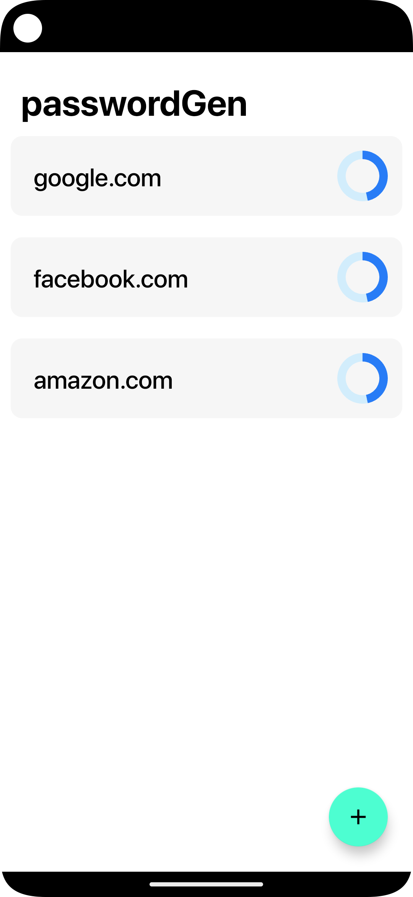

# passwordGen
## todo :
1. notification for password update quaterly [done]
2. migrating code to kotlin and implementing MVVM architecture [done]
3. encrypted database [done]
4. biometric verification
5. remote password retrival

## dashboard :

## create :

## read and update :

## delete :

## timer :

